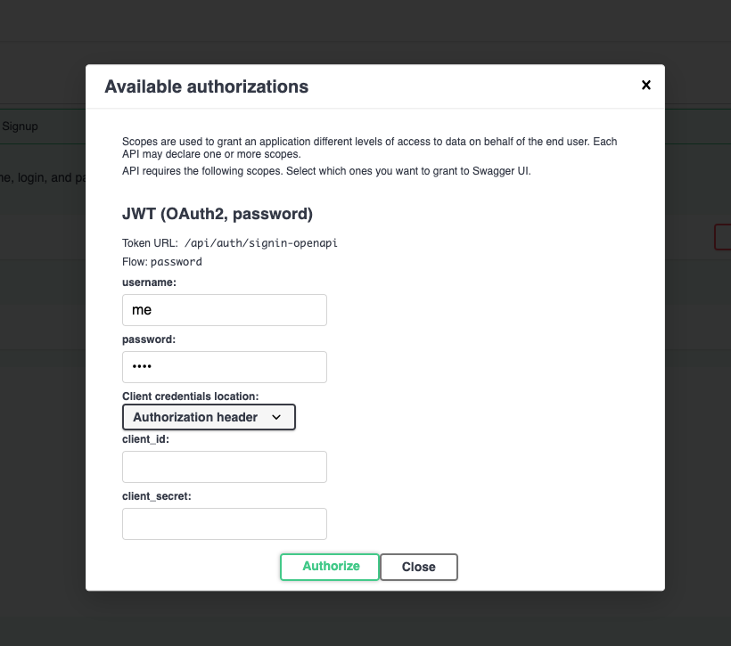
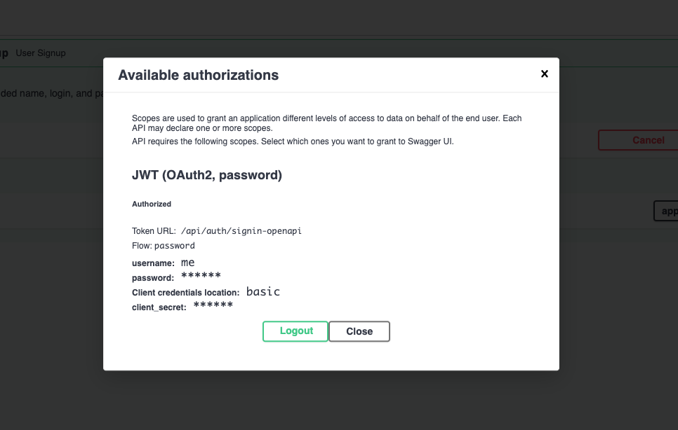
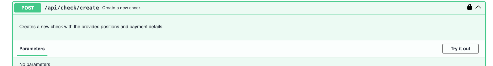
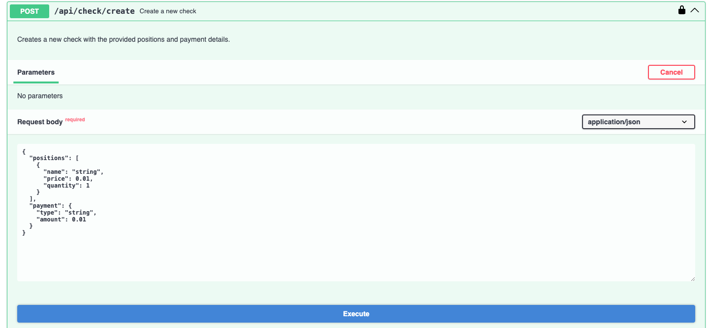

# checkbox

A simple FastAPI backend for creating and managing checks (receipts), with PostgreSQL for data storage and Adminer for database inspection.

---

## Features

- User signup and authentication
- Create checks with positions and payment details
- PostgreSQL database with SQLModel ORM
- Adminer UI for database management
- Dockerized for easy setup

---

## Getting Started

### Prerequisites

- [Docker](https://www.docker.com/get-started) and [Docker Compose](https://docs.docker.com/compose/) installed

### 1. Clone the Repository

### 2. Create a `.env` File OR 

Create a `.env` file in the root directory with the following content (replace values as needed):

```env
POSTGRES_USER=youruser
POSTGRES_PASSWORD=yourpassword
POSTGRES_DB=checkbox
POSTGRES_PORT=5432
SECRET_KEY=your_secret_key
```

# OR 
sipmply rename .env_to_copy to .env:

```bash
mv .env_to_copy .env
```

### 3. Build and Run the Services

on the top level directory run:   

```bash
docker compose up --build
```

- The **backend API** will be available at [http://localhost:8000](http://localhost:8000)
- **Adminer** (database UI) will be at [http://localhost:8080](http://localhost:8080)

### 4. API Documentation

Visit [http://localhost:8000/docs](http://localhost:8000/docs) for interactive API docs (Swagger UI).

For testing API you should first signup and then Authorize






### So, now you can test API!

#### Just click 'Try it out' and then click 'Execute'



#### fill required fields and click 'Execute'



---

## Development
- Press in terminal 'W' to open watch mode
- The backend will auto-reload on code changes.
- Database data is persisted in a Docker volume.

To stop the services:

```bash
docker compose down
```

---

## Project Structure

```
.
├── backend/
│   ├── app/
│   ├── requirements.txt
│   └── Dockerfile
├── docker-compose.yml
├── docker-compose.override.yml
├── .env
└── README.md
```

---